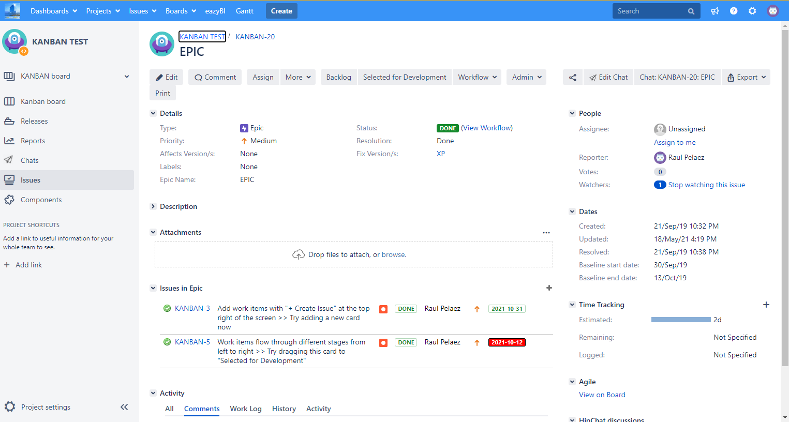

# Extended-Issues-in-Epic-panel-for-Jira
This plugin extends the Issues in Epic panel of Jira and show the Priority icon in each ticket also the DueDate (in Green if not overdue or Red if overdue. New status Colors PRO compatible). Compatible with Jira 7.x-8.x

[Download Extended Issues in Epic panel for Jira by MrAddon](https://github.com/MrAddon/Extended-Issues-in-Epic-panel-for-Jira/releases)
